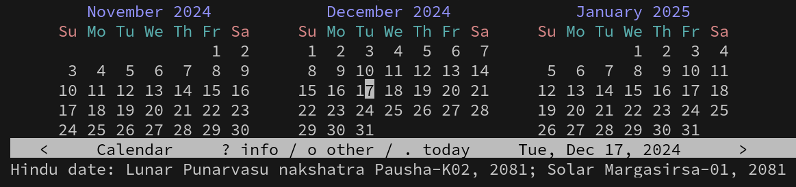

# hindu-calendar

A simplified arithmetical Hindu calendar (panchanga) for Emacs.

This package provides traditional Hindu calendars (solar and lunar) using
arithmetic based on the _mean_ motions of the Sun and Moon. It calculates tithi
and nakshatra. It provides both tropical (sāyana) and sidereal (nirayana/Lahiri
ayanāmsa) variants. Lunar calendars can be chosen between amānta or purnimānta.

## Installation

This package is available on MELPA, do `M-x package-install RET hindu-calendar`.
If you want to install it manually (example):

```shell
git clone https://github.com/bdsatish/hindu-calendar ~/.emacs.d/
```

and add these lines your `~/.emacs` (or equivalent init file):

```lisp
(add-to-list 'load-path "~/.emacs.d/hindu-calendar/")
(require 'hindu-calendar)
(hindu-calendar-keybindings) ; Optional key bindings
```

## Usage

All of the functions can be called interactively or programmatically.

| Calendar type           | Function/command                  |
|-------------------------|-----------------------------------|
| Sidereal lunar          | M-x hindu-calendar-sidereal-lunar |
| Tropical lunar          | M-x hindu-calendar-tropical-lunar |
| Sidereal solar          | M-x hindu-calendar-sidereal-solar |
| Tropical solar          | M-x hindu-calendar-tropical-solar |
| Nakshatra (sidereal)    | M-x hindu-calendar-asterism       |

If you are not sure which one to use, then start with the first one:
`(hindu-calendar-sidereal-lunar)`

All of these functions accept year, month and date as arguments. If none are
given, then today's values are used.

```
ELISP> (hindu-calendar-sidereal-lunar 2030 6 21)
"Jyaishtha-K06, 5131"
ELISP> (hindu-calendar-tropical-lunar 2030 6 21)
"Ashadha-K06, 5131"
ELISP> (hindu-calendar-sidereal-solar 2030 6 21)
"Jyaishtha-07, 5131"
ELISP> (hindu-calendar-tropical-solar 2030 6 21)
"Jyaishtha-31, 5131"
ELISP> (hindu-calendar-asterism 2030 6 21)
"Satabhishaj"
```

`S` and `K` denote _ṡukla-pakṣa_ and _kṛṣṇa-pakṣa_ respectively. For example,
K06 above means _kṛṣṇa-pakṣa-ṣaṣṭhī_. Years are counted as elapsed Kali-yuga
(_gatakali_). Negative years are supported too, as per [proleptic Gregorian
calendar](https://en.wikipedia.org/wiki/Proleptic_Gregorian_calendar).

The lunar calendars by default follow _amānta_ (or _amāvāsyānta_) scheme, i.e.,
a month ends on new-moon day. This is the scheme used mostly in the
non-Hindi speaking parts of India. Much of North India uses _pūrṇimānta_, i.e.,
a month ends on full-moon day. [See here for
explanation](https://www.drikpanchang.com/faq/faq-ans8.html).

## Customization

All the below options can be customized via `M-x customize-group RET hindu-calendar`.

By default, the month names use `"Chaitra"`, Vaisakha, etc. Other options are:

- `"Mesha"` for Mesha, Vrishabha, etc. which are zodiacal names.
- `"Madhu"` for Madhu, Madhava, etc. which are ancient Vedic names.
- `"Kesava"` for Kesava, Narayana, etc. which are the twelve names of Lord Vishnu.
- `"Dhata"` for Dhātā, Aryamā, etc. which are the names of
   [twelve Ādityas](http://www.harekrsna.de/surya/12adityas.htm).
- `"Baisakha"` as first month of new solar year, as in Bengal, Assam, Odisha, etc.

Customize variable `hindu-calendar-month-type` to one of the above.

By default, the years are counted as elapsed `"Kali"`-yuga years. Other options are:

- `"Vikrama"` for Vikrama (or Bikram) samvat, whose epoch is 57 BCE.
- `"Saka"` for Salivahana saka, whose epoch is 78 CE.
- `"Kali"` for elapsed Kali varsha, whose epoch is 3102 BCE (i.e., -3101).
- `"Bengali"` for Bengali san, whose epoch is 593 CE.

Customize variable `hindu-calendar-epoch-type` to one of the above.

By default, `"amanta"` new-moon based lunar calendar is used. Customize variable
`hindu-calendar-lunar-type` to `"purnimanta"` for full-moon based reckoning.

Here are some typical combinations:

| Category                      | `hindu-calendar-` | `hindu-calendar-month-type` | `hindu-calendar-epoch-type` |
|:------------------------------|-------------------|-----------------------------|-----------------------------|
| [Indian national calendar][1] | tropical-solar    | chaitra                     | saka                        |
| Kannadiga, Marathi, Telugu    | sidereal-lunar    | chaitra                     | saka                        |
| Gujarati                      | sidereal-lunar    | chaitra                     | vikrama (kārttikādi)        |
| Tamizhan                      | sidereal-solar    | chaitra                     | saka, kali                  |
| Malayali                      | sidereal-solar    | mesha                       | kollam                      |
| Bengali                       | sidereal-solar    | baisakha                    | bengali                     |
| Odia                          | sidereal-solar    | baisakha                    | bengali, vilayati           |
| Nepali, Punjabi               | sidereal-solar    | baisakha                    | vikrama                     |
| Rest of India (purnimanta)    | sidereal-lunar    | chaitra                     | vikrama                     |
| Vedic (Vajasaneyi/Taittiriya) | tropical-lunar    | madhu                       | N/A                         |

[1]: https://en.wikipedia.org/wiki/Indian_national_calendar

Of course, each language has its own names for the months (e.g., Agraha(ya)n,
Margazhi, etc. for Margasirsa) but it is hoped that the above is indicative
enough.

It is also integrated with Emacs' calendar. Type `M-x calendar` to open-up 3-month
calendar view. Move cursor (point) over any date you want. Type `p H` (uppercase H)
to print Hindu calendar in the echo area. Here's an example with settings for
someone in Mathura or Varanasi, where Purnimanta/Vikrama era is the norm:

[Sample screenshot](screenshot.jpg):



## Accuracy

This program is about as accurate as your traditional siddhantic panchangas.
That is, it differs by a maximum of ±1 lunar day (_tithi_) or ±1 solar day or ±1
nakshatra compared to the true values. Though rare, an _adhika-māsa_ (leap
month) can be off by ±1 month too. Any dates in the range of ±5000 years are
supported.

Calendrical calculations are of two types: arithmetical and astronomical.
Arithmetical calendars are simpler to understand (and implement!) because they
use [mean motion](https://en.wikipedia.org/wiki/Mean_motion) (i.e. average
values) of the Sun and Moon. They are crude approximations to the _true motion_,
used by astronomical calendars.

The biggest advantage of arithmetical calendars is that they can be computed
independent of location, by assuming a reasonable time of sunrise (e.g. 6:00
A.M.). Astronomical calendars change their dates based on one's location and
sunrise timings. The Python program
[drik-panchanga](https://github.com/bdsatish/drik-panchanga) is astronomical
and thus gives best accuracy.

## Bugs

Yes, many. Please [report a new issue](https://github.com/bdsatish/hindu-calendar/issues).

## Licence

Copyright (C) B.D.Satish. GNU Affero GPL v3 (or later).

<!--
[Dieter Koch's](https://www.gilgamesh.ch/kalender/kalender.html) website uses
better approximations to the true motions.
-->
